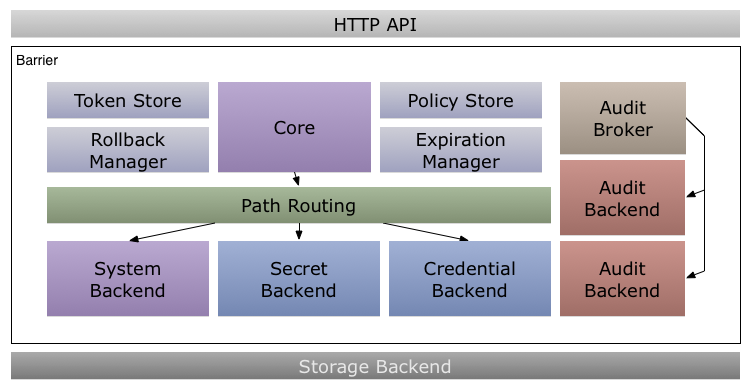

<!-- .slide: data-background="#6C1D5F" -->
<center><div style="width: 75%; height: auto;"></div></center>
<br />
<center>
<table>
  <tr>
    <td>**Armin Coralic**</td><td>*[acoralic@xebia.com](mailto:acoralic@xebia.com)*</td>
  </tr>
  <tr>
    <td>**Ivo Verberk**</td><td>*[iverberk@xebia.com](mailto:iverberk@xebia.com)*</td>
  </tr>
  <tr>
    <td>**Werner Buck**</td><td>*[wbuck@xebia.com](mailto:wbuck@xebia.com)*</td>
  </tr>
  <tr><td>&nbsp;</td></tr>
  <tr>
    <td>**Slides**</td><td>[http://nauts.io/vault-meetup](http://nauts.io/vault-meetup)</td>
  </tr>
  <tr>
    <td>**Files**</td><td>[http://github.com/nautsio/vault-meetup](http://github.com/nautsio/vault-meetup)</td>
  </tr>
</table>
</center>

!SLIDE
<!-- .slide: data-background="#6C1D5F" -->
<center></center>

!SLIDE
# Vault
Vault is a tool for **securely** accessing secrets. A **secret** is anything that you want to tightly control access to, such as API keys, passwords, certificates, and more. Vault provides a **unified interface** to any secret, while providing **tight access control** and recording a detailed **audit log**.

!SUB
# Without Vault
- More and more secrets
- Secrets all over the place
- No insight who uses which secret
- No procedure in case something bad happens

!SUB
# With Vault
- Centralized source for secrets
- Unified access interface
- Pluggable backends

!SUB
# Architecture


!SUB
# (Un)sealing the Vault


!SLIDE
<!-- .slide: data-background="#6C1D5F" -->
# Backends

!SUB
# Storage Backend
A storage backend is responsible for durable storage of encrypted data. Backends are not trusted by Vault and are only expected to provide durability. The storage backend is configured when starting the Vault server.

!SUB
# Secret Backend
A secret backend is responsible for managing secrets. Simple secret backends like the "generic" backend simply return the same secret when queried. Some backends support using policies to dynamically generate a secret each time they are queried.

!SUB
# Auth Backend
Auth backends are the components in Vault that perform authentication and are responsible for assigning identity and a set of policies to a user.

!SUB
# Audit Backend
Audit backends are the components in Vault that keep a detailed log of all requests and response to Vault.

!SLIDE
<!-- .slide: data-background="#6C1D5F" -->
# The Setup

Download from

!SUB
# Start vault server

Start in dev mode (always unsealed)
```
$ vault server -dev &> vault.log &
==> WARNING: Dev mode is enabled!
...
```
Configure client
```
$ export VAULT_ADDR='http://127.0.0.1:8200'
$ vault status
Sealed: false
Key Shares: 1
Key Threshold: 1
Unseal Progress: 0

High-Availability Enabled: false
```

!SLIDE
<!-- .slide: data-background="#6C1D5F" -->
# Secrets (IVO)

!SUB
# Hello world secret

```
$ vault write secret/hello value=world
Success! Data written to: secret/hello
```

!SUB
# Alternate syntax

There are multiple ways to write data, including stdin and from file.

From stdin
```
$ echo -n "bar" | vault write secret/foo value=-
Success! Data written to: secret/hello
```

From file

```
$ cat << EOF > data.json
{ "value": "itsasecret" }
EOF
$ vault write secret/password @data.json
...
```

read write syntax doc: [/docs/commands/read-write.html](https://www.vaultproject.io/docs/commands/read-write.html)

!SUB (Ivo)
# Policies

* token-create
* policy maken

!SUB (Ivo (?))
# Auth

* User/pass

!SLIDE
<!-- .slide: data-background="#6C1D5F" -->
# Dynamic Secrets

!SUB
# PostgreSQL Secret backend (Werner)

!SUB
# Transit secret backend (Armin)

!SUB
# Cubbyhole backend (Armin)

!SLIDE
<!-- .slide: data-background="#6C1D5F" -->
# Advanced

!SUB
# SSH (Armin)

!SUB
# Github (Werner)

!SLIDE
<!-- .slide: data-background="#6C1D5F" -->
<center></center>
Want to hear **best practices** and the **latest news** about Vault and other HashiCorp products?

TODO: CODE 

Come to **HashiConf EU the 13th-15th of June**!
